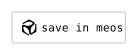
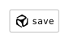
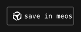
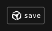

# @meoslabs/save-in-meos

[](https://www.npmjs.com/package/@meoslabs/save-in-meos)
[](https://bundlephobia.com/package/@meoslabs/save-in-meos)
[](https://github.com/meoslabs/save-in-meos/actions/workflows/ci.yml)
[](LICENSE)
[](https://meoslabs.github.io/save-in-meos/)
[](https://www.jsdelivr.com/package/npm/@meoslabs/save-in-meos)

<p align="center">
  <a
    href="https://meos.do/databox:import:q1bKVrJSKlXSAWIrpYySkoJiK3399MySjNIkveT8XP3c1PzinMSkYv3ixLJU3cw8XZCAUi0A?w=github-readme"
    title="Try it — saves this repository into meos"
  >
    
  </a>
</p>

<p align="center">
  <strong>↑ Click the chip</strong> — opens a real <code>meos.do</code> import for this repo.<br />
  <a href="https://meoslabs.github.io/save-in-meos/readme-embed.html?w=github-readme"><strong>Live widget demo →</strong></a>
  &nbsp;·&nbsp;
  <a href="https://meoslabs.github.io/save-in-meos/">all interactive examples</a>
</p>

---

**One tap. Any page. Into [meos](https://meos.do).**

Drop a branded **save in meos** chip into your share row, toolbar, or blog post. Visitors tap it → meos opens with a canonical import URL — page URL, optional quote, and **your site name in `?w=`** for provenance.

No build step required for script-tag embeds. npm package for bundlers. MDP codec if you only need the link.

---

## Try it now

| What | How |
|------|-----|
| **In this README** | Click the banner above — real import link (GitHub blocks `<script>`, so this is a linked chip that opens meos) |
| **Live widget** | [readme-embed.html](https://meoslabs.github.io/save-in-meos/readme-embed.html?u=https://github.com/meoslabs/save-in-meos&w=github-readme) — full interactive chip |
| **On your machine** | `npm run demo` → http://localhost:4173 |

---

## Put it on your site

You configure **three things**. The chip label is brand-fixed (see presets below) — not arbitrary custom text.

| Option | Required? | What it does | Example |
|--------|-----------|--------------|---------|
| **`u`** | yes | Canonical URL to save into meos | `location.href` or article permalink |
| **`widgetId`** | recommended | **Provenance** — your site id, carried as `?w=` on the import URL | `"my-blog"`, `"hn-reader"` |
| **`chipPreset`** | no | Chip size + label variant | `"default"` or `"compact"` |
| **`t`** | no | Optional quoted text (LITE tier) | User's text selection |
| **`theme`** | no | `auto` · `light` · `dark` | `"dark"` on a dark toolbar |

### Example — your article, your provenance id

```html
<link
  rel="stylesheet"
  href="https://unpkg.com/@meoslabs/save-in-meos@0.0.4/src/widget/fonts.css"
/>
<div id="meos-save-mount"></div>
<script src="https://unpkg.com/@meoslabs/save-in-meos@0.0.4/dist/widget.iife.js"></script>
<script>
  MeosSave.initSaveButton("#meos-save-mount", {
    // 1) What to save
    u: "https://yoursite.com/posts/decentralised-notes",

    // 2) Provenance — shows up as ?w=my-blog on the meos import URL
    widgetId: "my-blog",

    // 3) Chip look (label is preset, not free text)
    chipPreset: "default", // logo + "save in meos"
    theme: "auto",
  })
</script>
```

### Example — save a quote the user selected

```js
MeosSave.initSaveButton("#meos-save-mount", {
  u: "https://yoursite.com/posts/decentralised-notes",
  t: window.getSelection()?.toString().trim() || undefined,
  widgetId: "my-blog-quote-save",
  chipPreset: "compact", // logo + "save"
})
```

When the user taps the chip, meos receives something like:

```http
https://meos.do/databox:import:{encoded}?w=my-blog-quote-save
```

The **`widgetId` is how meos knows which integrator sent the import** — use a stable string per site or surface (not per user).

### Label presets (not custom text)

| `chipPreset` | Visible label | Best for |
|--------------|---------------|----------|
| `default` | **save in meos** | Share rows, article footers |
| `compact` | **save** | Dense toolbars |

`aria-label` is always **save in meos**. Font, logo, and colours are brand-locked — you pick preset, theme, and bounded size tokens only.

---

## Quick start — npm

```bash
npm install @meoslabs/save-in-meos
```

```ts
import "@meoslabs/save-in-meos/fonts.css"
import "@meoslabs/save-in-meos/widget.css"
import { initSaveButton } from "@meoslabs/save-in-meos"

initSaveButton("#meos-save-mount", {
  u: "https://example.com/article",
  widgetId: "my-site",
})
```

## Quick start — links only (no widget)

```ts
import { buildMeosLink, buildImportIntentV1 } from "@meoslabs/save-in-meos"

const url = buildMeosLink(
  buildImportIntentV1({
    u: "https://example.com/article",
    t: "Optional pull-quote",
  }),
  "my-site", // → ?w=my-site
)
```

---

## Chip gallery

<p align="center">
  <a href="https://meos.do/databox:import:q1bKVrJSKlXSAWIrpYySkoJiK3399MySjNIkveT8XP3c1PzinMSkYv3ixLJU3cw8XZCAUi0A?w=github-readme">
    
  </a>
  <a href="https://meoslabs.github.io/save-in-meos/readme-embed.html?preset=compact&w=github-readme-gallery">
    
  </a>
</p>

<table>
  <thead>
    <tr>
      <th></th>
      <th><code>default</code></th>
      <th><code>compact</code></th>
    </tr>
  </thead>
  <tbody>
    <tr>
      <td><strong>light</strong></td>
      <td align="center">
        <a href="https://meos.do/databox:import:q1bKVrJSKlXSAWIrpYySkoJiK3399MySjNIkveT8XP3c1PzinMSkYv3ixLJU3cw8XZCAUi0A?w=github-readme">
          
        </a>
      </td>
      <td align="center">
        <a href="https://meoslabs.github.io/save-in-meos/readme-embed.html?preset=compact&theme=light&w=github-readme">
          
        </a>
      </td>
    </tr>
    <tr>
      <td><strong>dark</strong></td>
      <td align="center">
        <a href="https://meos.do/databox:import:q1bKVrJSKlXSAWIrpYySkoJiK3399MySjNIkveT8XP3c1PzinMSkYv3ixLJU3cw8XZCAUi0A?w=github-readme">
          
        </a>
      </td>
      <td align="center">
        <a href="https://meoslabs.github.io/save-in-meos/readme-embed.html?preset=compact&theme=dark&w=github-readme">
          
        </a>
      </td>
    </tr>
  </tbody>
</table>

<sub>Left column chips open a real meos import. Right column opens the <a href="https://meoslabs.github.io/save-in-meos/readme-embed.html">live widget</a>.</sub>

---

## CDN

Pin the version — never use `@latest` in production.

| Mirror | Widget IIFE | Fonts |
|--------|-------------|-------|
| **unpkg** | `https://unpkg.com/@meoslabs/save-in-meos@0.0.4/dist/widget.iife.js` | `…/src/widget/fonts.css` |
| **jsDelivr** | `https://cdn.jsdelivr.net/npm/@meoslabs/save-in-meos@0.0.4/dist/widget.iife.js` | same path |

Alias: `dist/save-in-meos.min.js` (identical bundle).

---

## What is MDP?

The **meos deeplink protocol** encodes an import intent into `https://meos.do/databox:import:…`. Widget attribution rides in **`?w={widgetId}`**.

| Tier | Use when |
|------|----------|
| **REF** | Page URL only |
| **LITE** | URL + quoted text (`t`) |
| **IMG** | URL + image URLs |
| **FULL** | Structured blocks (advanced) |

---

## Development

```bash
npm install
npm run build && npm run build:widget
npm test && npm run check:mdp
npm run demo    # http://localhost:4173
```

After bumping `package.json` version: **`npm run version:sync`**.

---

## Docs

| Doc | For |
|-----|-----|
| [`docs/INTEGRATOR.md`](docs/INTEGRATOR.md) | Full widget API + branding rules |
| [`docs/PUBLISHING.md`](docs/PUBLISHING.md) | npm release + CI |
| [`CONTRIBUTING.md`](CONTRIBUTING.md) | Contributors |

## Licence

MIT · Inconsolata [OFL-1.1](assets/fonts/inconsolata/OFL.txt)
